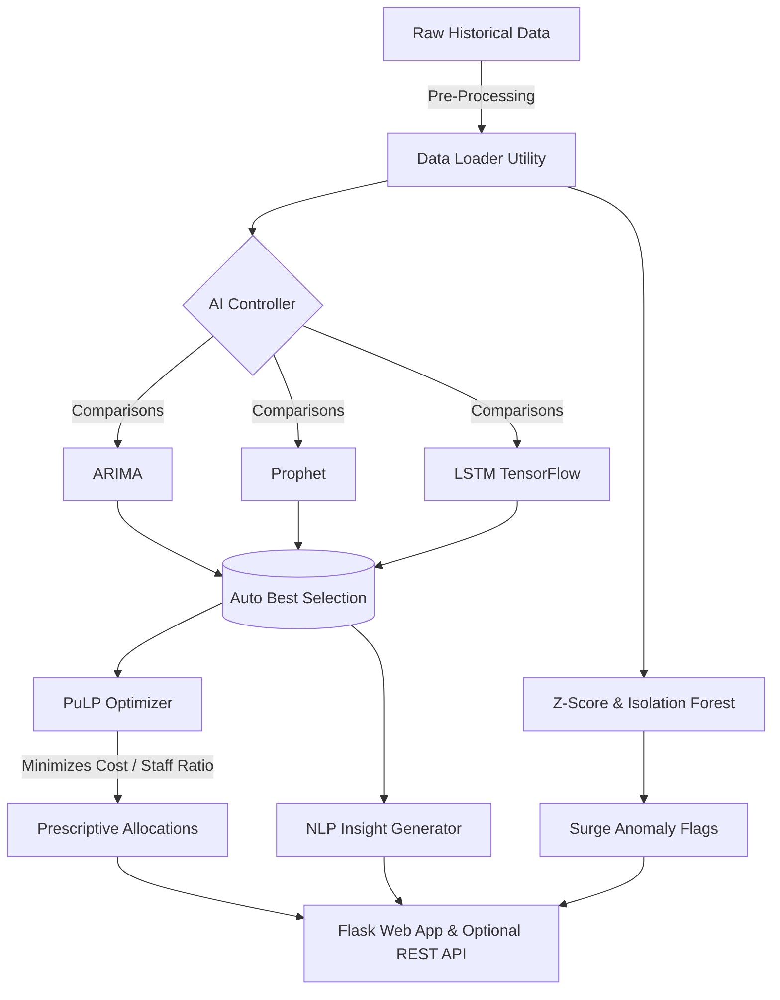

#  MediOptima – AI-Powered Hospital Resource Optimization System

<p align="center">
  <b>A Production-Ready AI Pipeline for Predictive Healthcare Operations</b><br>
  <i>Perfect for Final Year Projects, Portfolio Demonstrations, and Operational Logistics Researches.</i>
</p>

##  Project Overview
MediOptima bridges the gap between historical hospital data and real-world operational readiness. By automating time-series machine learning, generating rule-based anomaly intelligence, and computing constraints via linear programming, MediOptima ensures hospitals never suffer from unexpected bed deficits or staff shortages. 


##  Architecture Design



##  Analytical Metrics Tracked 
All AI pipelines are continuously benchmarked avoiding model decay.
- **MAPE** (Mean Absolute Percentage Error) is the primary ranking factor determining which ML code powers the dashboard dynamically.
- **RMSE & MAE** supplied for total transparency.

##  Setup & Execution

### 1. Requirements & Clone
Ensure you have Python 3.9+ installed and `pip` working.

```bash
git clone https://github.com/your-username/MediOptima.git
cd MediOptima
```

### 2. Virtual Environment
```bash
python -m venv venv
source venv/bin/activate  # Windows users: venv\Scripts\activate
pip install -r requirements.txt
```

### 3. Prime the AI (Generate Data)
MediOptima requires a working dataset to analyze. Run the internal script to simulate exactly 365 days of a hospital ecosystem (Seasonal flows, outbreaks, holidays).
```bash
python scripts/generate_data.py
```

### 4. Deploy the Dashboard
```bash
python app.py
```

##  Modularity and Customization
* Modules are purely decoupled. 
* Look into `config/config.py` to change logic like `DOC_TO_PATIENT_RATIO` directly without digging into raw scripts.

##  Planned Roadmap
- PDF Generation Reports using `ReportLab`.
- Full Dockerization `Dockerfile` setup.

---
*Created as part of an Advanced System Architecture and Machine Learning initiative.*
